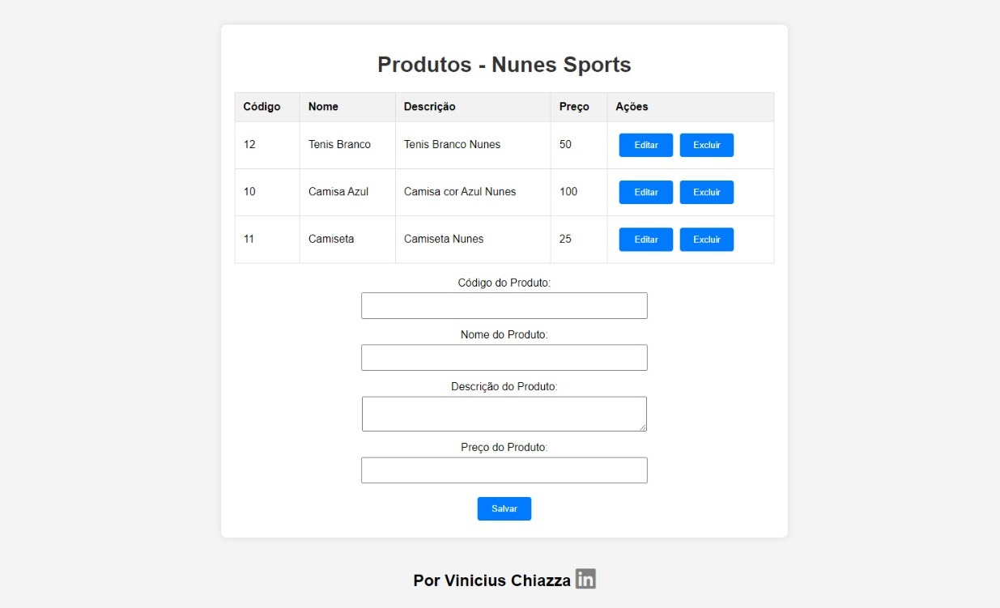

# Projeto Nunes Sports 🏀⚽

  

## Introdução

O **Projeto Nunes Sports** é uma aplicação web desenvolvida para gerenciar produtos esportivos. A aplicação oferece operações CRUD (Create, Read, Update, Delete) para manter um catálogo de produtos atualizado, utilizando o banco de dados MongoDB um banco de dados NoSQL.

## Funcionalidades

- **Cadastro de Produtos:** Adicione novos produtos informando código, nome, descrição e preço.
- **Edição de Produtos:** Atualize as informações de um produto existente.
- **Exclusão de Produtos:** Remova produtos do catálogo.
- **Visualização de Produtos:** Consulte a lista completa de produtos.

## Tecnologias Utilizadas

- Node.js
- Express
- MongoDB
- Mongoose
- CORS

## Validação de Dados

O código do produto é único, garantindo que não haja repetição.

## Como Usar

1. Clone este repositório.
2. Instale as dependências usando `npm install`.
3. Inicie o servidor com `node server.js`.
4. Inicie o banco de dados com `mongod`, e tenha certeza de ter o mongoDB e mongoose instalados com `npm install mongoose`.
5. Acesse a aplicação no navegador: [http://localhost:3000](http://localhost:3000).

## Desenvolvedor

- Vinicius Chiazza - Desenvolvedor Fullstack [LinkedIn](https://www.linkedin.com/in/viniciuschiazza/) 👨‍💻
